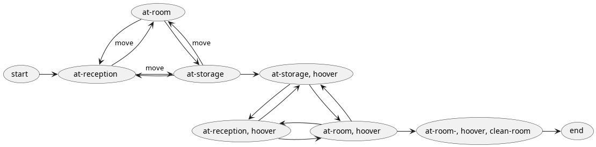

# Task 2 

Git Url to exercise fork: https://github.com/Scraylex/WAS-exercise-2

# Task 3 Findings

## 1) What is the anomaly that occurs when solving the problem in the domain?

The planner takes an unneccessary step in moving explicitly to the storage1 to get the hoover before cleaning the room. This extra step is taken because of the the choosen graph search algorithm.

## 2) Under what circumstances does the anomaly occur?

The Sussman anomaly occurs in planning problems that involve a set of interdependent actions that must be performed in a specific order to achieve a particular goal state. Every state and action is interpreted individually as edges (actions) and vertices (states) in a graph. This is to say that it is possible that an automated plan might take unneccessary state transitions before reaching the end goal or even getting stuck in a loop.

## 3) What specifically in the problem and the domain make it susceptible?

This problem occurs because of the backward search used in STRIPS-like planners. It is possible to take a path which ultimately satisfies the given intital state but may take suboptimal steps according to the search algorithm used in the graph traversal.

Specifically at the point after getting the hoover it is possible to either go directly back into the wanted initial state of being in the receiption or going back into room. After that it is possible to either go into the storage or to the receiption from the room.

According to how the traversal algorithm functions this could recurse indefinetly.

This can be seen visually in the  there exists triangle which could end in a permanent recursion.

This problem could be remedied by makeing new actions which more clearly specify where the agent should move to or adding various other predicates ensureing a even more linear graph.

## 4) Why is the behavior not observable with your planner implementation from Task 2?

Because the A* algorithm is a deterministic pathfinding algorithm i.e. in it's heuristic it will always search for the most optimal traversal path across the graph.

This behaviour is in fact observable with using the Enforce Hillclimb Search algorithm using the python planner. Sometimes it will take 4 steps sometimes 5. Probably because of the heuristic metric assosiated.
